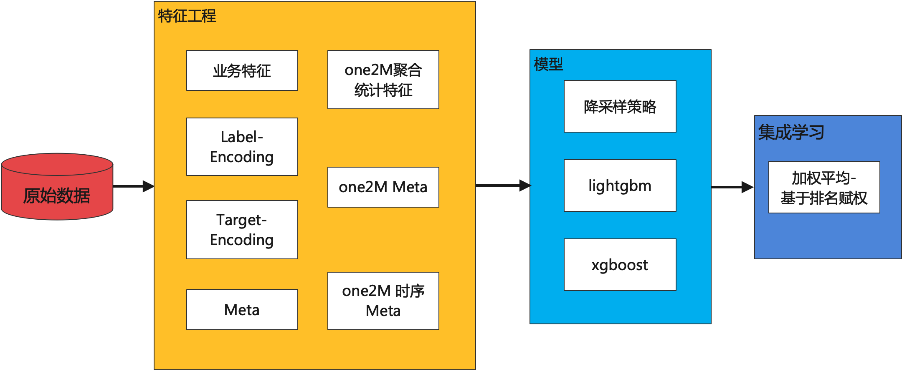

本项目的代码是基于[NoxMoon](https://github.com/NoxMoon)的项目[home-credit-default-risk](https://github.com/NoxMoon/home-credit-default-risk)进行修改。

## 比赛介绍
为了确保人们贷款是否正当合理，Home Credit希望利用各种数据（包括电信和交易信息）来预测客户的还款能力。
具体来说，参赛者需要综合各种信息来预测每一笔贷款是否会被延期还款。

## 整体方案



## 数据
将数据下载到input文件夹下并解压
- 数据下载地址: https://www.kaggle.com/competitions/home-credit-default-risk/data

## 代码文件说明
```
src
├── ensemble
	├── opt_weights.py # 集成学习，对不同的单模型结果加权融合
├── feature_engineer
	├── house-doc-feats.py 
	# 主表meta特征构造
	├── cc-ts.py  
	# 对credit_card_balance表构造1对多副表时序meta特征
	├── pos-ts.py  
	# 对POS_CASH_balance表构造1对多副表时序meta特征
	├── bubl-ts.py 
	# 对bureau表构造1对多副表时序meta特征
	├── inst-ts.py  
	# 对installments_payments表构造1对多副表时序meta特征
	├── prev-training.py 
	# 对previous_application表构造1对多副表meta特征
	├── buro-training.py 
	# 对bureau表构造1对多副表meta特征
	└── month-training.py  
	# 对POS_CASH_balance表关于SK_ID_CURR列和月份进行聚合，计算其他列的聚合统计信息，以此构造出一张新的1对多副表，再对这张副表生成副表meta特征
└── model
	├── lgb1.py 
	# lightgbm单模型，第1组超参数
    	包含了其他特征（业务特征，类别型特征编码，聚合统计特征等）
    	以及降采样策略
	├── lgb2.py # 同上，第2组超参数
	├── lgb3.py # 同上，第3组超参数
	└── xgb1.py # 同上，使用了xgboost单模型
```

## 执行方式
1. 执行特征工程
```
python ./src/feature_engineer/prev-training.py
python ./src/feature_engineer/buro-training.py
python ./src/feature_engineer/month-training.py
python ./src/feature_engineer/house-doc-feats.py
python ./src/feature_engineer/inst-ts.py
python ./src/feature_engineer/bubl-ts.py
python ./src/feature_engineer/pos-ts.py
python ./src/feature_engineer/cc-ts.py
```
2. 执行模型
```
python ./src/model/lgb1.py
python ./src/model/lgb2.py
python ./src/model/lgb3.py
```
3. 执行集成学习
```
python ./src/ensemble/opt_weights.py
```
结果保存在output文件夹下（最终文件为ensemble.csv）


## 最终结果

|       |  Private LB | Public LB  |
|-------| ------------ | ------------ |
| lgb_1 |  0.80026 | 0.80491  |
| lgb_2 | 0.80021 | 0.80492  |
| lgb_3 | 0.80011 | 0.80476  |
| ensemble     | 0.80028| 0.80494 |

最终结果排名：36/7176